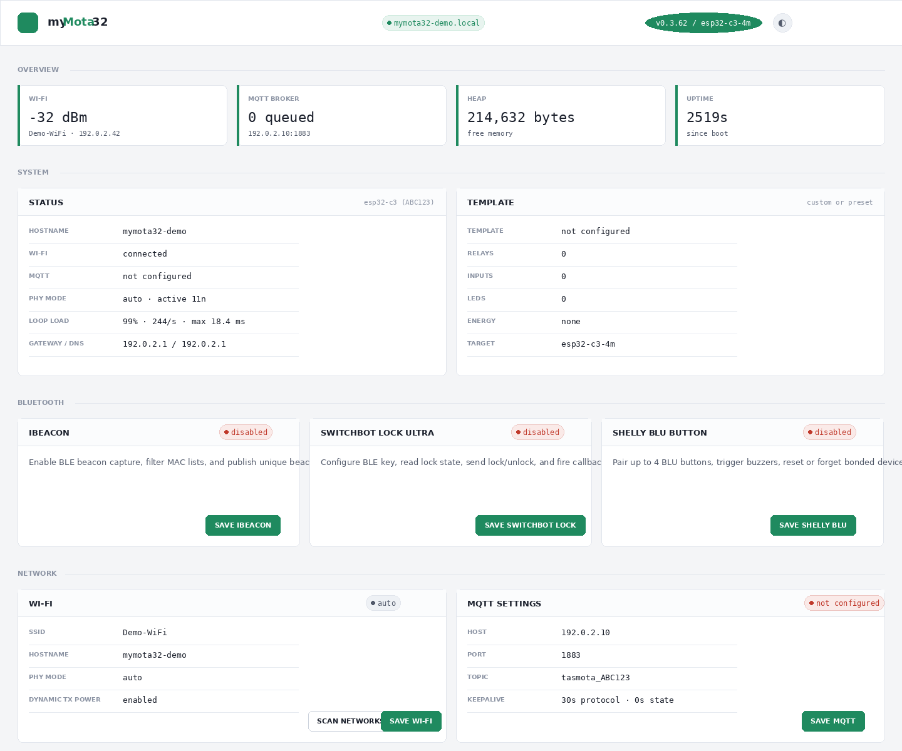
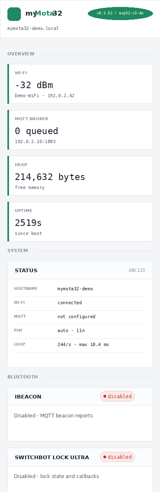
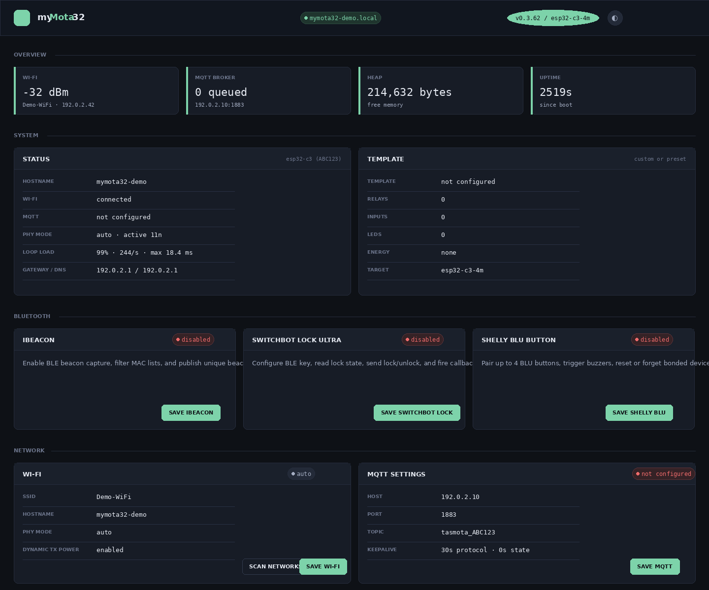
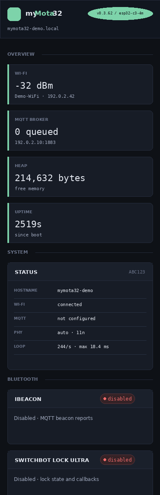

# myMota32

A hat tip to Tasmota and Tasmota32: this project exists because those firmwares
proved how useful local, template-driven, MQTT-first device firmware can be.
myMota32 is an ESP32 smart-home firmware built for local control, Tasmota32 OTA
migration, Tasmota-style hardware templates, MQTT automation, BLE integrations,
energy monitoring, and a compact device web UI.

myMota32 is intended for devices that should remain usable without a cloud
service. It exposes a browser UI for configuration, a `/health` JSON endpoint
for monitoring, Tasmota-like `/cm?cmnd=...` command handling, and MQTT command
topics compatible with common home-automation flows.

## Screenshots

The screenshots below are sanitized captures based on the live tester device UI.
All device identifiers, hostnames, network values, and credentials have been
replaced with placeholders.

| Light desktop | Light mobile |
| --- | --- |
|  |  |

| Dark desktop | Dark mobile |
| --- | --- |
|  |  |

## Highlights

- Tasmota32 OTA migration support: upload the chip-specific myMota32 binary
  from the Tasmota32 firmware upgrade page.
- Direct serial flashing support for devices that are blank, bricked, or being
  recovered on a bench.
- Tasmota-style JSON template paste support for ESP32 and ESP32-C3 layouts.
- Built-in template list for commonly used Shelly, NOUS, Sonoff, Switchbot, and
  generic relay devices.
- Local web UI with light and dark themes, status tiles, live `/health` polling,
  firmware upload, settings import/export, and system controls.
- MQTT control and telemetry with Tasmota-like command topics.
- HTTP command support through `/cm?cmnd=...`.
- Relay, switch, button, LED, light, energy, Bluetooth beacon, Switchbot Lock
  Ultra, and Shelly BLU Button features.
- No HTTPS, TLS, or MQTT authentication support is included by design.

## Supported Build Targets

The build script produces chip-specific images. Use the image that matches the
actual ESP32 chip family and flash layout:

- `esp32-d0wd-v3-4m` for ESP32-D0WD-V3 devices.
- `esp32-u4wdh-d-4m` for dual-core ESP32-U4WDH-D devices.
- `esp32-u4wdh-s-4m` for single-core ESP32-U4WDH-S / SOLO1 style devices.
- `esp32-c3-4m` for ESP32-C3 4 MB devices.

The firmware filename includes the target. The web UI also checks the uploaded
filename against the running target, and the device-side upload handler rejects
wrong-target uploads unless firmware target verification is disabled in the UI.

## Building

PlatformIO is used for builds:

```sh
./build_dist.sh
```

The script validates `platformio.ini`, builds all configured targets, verifies
image metadata, purges stale gzip artifacts, keeps only the latest three
firmware versions in `dist/`, and refreshes `dist/MD5SUMS` and
`dist/SHA256SUMS`.

Debug logging is controlled at build time in `[common] build_flags`. The default
release configuration is quiet:

- `MYMOTA32_DEBUG_LOG=0` and `CORE_DEBUG_LEVEL=0` produce production-style quiet
  builds. The myMota32 debug logging paths compile out when the flag is
  disabled.
- `MYMOTA32_DEBUG_LOG=1` enables detailed serial diagnostics at 115200 baud,
  routes myMota32 messages through the Arduino/ESP logging backend, and reports
  `debug_log:true` from `/health`.
- `CORE_DEBUG_LEVEL=5` should be paired with the debug build so ESP32 core
  diagnostics are visible when chasing startup, Wi-Fi, MQTT, OTA, BLE, input,
  relay, light, and energy issues.

Debug logs intentionally avoid printing Wi-Fi passwords, BLE keys, and other
secret values. Lengths, configured/not-configured flags, target names, timings,
status codes, queue depths, and state transitions are logged instead.

For OTA or web uploads, use the raw target image:

```text
dist/mymota32-<version>-<target>.bin
```

If a generated `-factory.bin` exists for a version, it is intended for serial
`write_flash` style recovery. When the app is too large for the safeboot slot,
the factory image is skipped and only the raw OTA image is produced.

## Switching From Tasmota32

myMota32 is designed to be migratable from Tasmota32 over OTA.

1. Identify the chip and target variant from Tasmota32 or serial boot logs.
   Examples include ESP32-C3, ESP32-D0WD-V3, ESP32-U4WDH-D, and
   ESP32-U4WDH-S / SOLO1.
2. Build or download the matching myMota32 target image from `dist/`.
   Do not cross-flash target variants.
3. Open the Tasmota32 web UI and use its firmware upgrade page.
4. Upload the matching `mymota32-<version>-<target>.bin`.
5. After reboot, the device should come up in myMota32. Configure Wi-Fi,
   MQTT, template, inputs, and any optional features from the myMota32 UI.

Some devices have a Tasmota32 safeboot partition. Future upgrades from myMota32
may move through the safeboot firmware first before returning to myMota32. Other
devices accept updates directly from myMota32 into the app partition. myMota32
exposes partition information in `/health` and shows Tasmota Safeboot settings
when a safeboot partition is detected.

## Direct Flashing

Direct flashing is useful for first installation, UART recovery, or devices that
cannot OTA boot. Use the target-specific firmware for the chip.

If a factory image exists:

```sh
esptool.py --chip esp32 write_flash -z 0x0 dist/mymota32-<version>-<target>-factory.bin
```

If only a raw app image exists, use the partition layout produced by the build
and flash bootloader, partition table, boot app marker, and app image at their
target offsets. The project partition layout is:

```text
nvs       0x009000  0x005000
otadata   0x00e000  0x002000
safeboot  0x010000  0x0d0000
app0      0x0e0000  0x2d0000
spiffs    0x3b0000  0x050000
```

Use DIO flash mode. ESP32 targets use 40 MHz flash; ESP32-C3 uses 80 MHz flash.

## Web UI

The root web UI is the primary configuration surface. It is organized into
status, template, device, Bluetooth, network, and maintenance areas.

- Overview tiles show Wi-Fi RSSI, MQTT queue depth, heap, and uptime.
- System Status shows hostname, chip model, chip ID, firmware target, loop
  performance, flash and partition information, Wi-Fi SDK state, gateway, DNS,
  MQTT state, iBeacon report rate, and whether debug serial logging is compiled
  into the running build.
- Template shows the decoded hardware profile: relays, inputs, LEDs, energy
  driver, light driver, and unsupported template functions.
- Settings export/import allows moving device settings between devices without
  exporting Wi-Fi SSID or password.
- Firmware upload supports target filename verification.
- System controls include power saving, dynamic Wi-Fi TX power, reboot, and
  factory reset.

## Templates

myMota32 accepts Tasmota-style template JSON by copy and paste. The parser reads
`NAME`, `GPIO`, `FLAG`, `BASE`, and the relevant GPIO function codes, then maps
supported functions to runtime relays, inputs, LEDs, energy drivers, light
drivers, ADC temperature, and I2C pins.

Built-in ESP32-C3 templates:

- Generic C3 Relay
- Switchbot W1401400

Built-in ESP32 templates:

- NOUS A8T
- NOUS B1T
- NOUS B3T
- Shelly Plus 1
- Shelly Plus 1PM
- Shelly Plus 2PM PCB v0.1.9
- Shelly Plus i4
- Shelly Plus Plug S
- Sonoff Dual R3 v2
- Sonoff MINIR4

Unsupported template functions are listed in the UI so the user can see what was
ignored. Energy metering and light output support are implemented only for the
drivers currently present in the firmware.

## Relays, Inputs, Buttons, and LEDs

Relays can be controlled from the web UI, MQTT, `/cm`, button actions, switch
inputs, and webhook actions. `POWER` and `POWER1` both map to relay 1 when only
one relay is available.

Inputs can operate as:

- Button actions: debounced press and hold events trigger an action.
- Switch follows output: physical switch state drives a relay.

Button actions can:

- Do nothing.
- Toggle a relay.
- Publish an MQTT topic and payload.
- Execute an HTTP webhook.

Action text supports placeholders such as `{BUTTONID}`, `{TYPE}`, `{TOPIC}`, and
relay state placeholders. When a button has no hold action configured, the press
action fires immediately on the debounced press edge for lower latency.

LED outputs can be attached to relay state, input state, Wi-Fi/MQTT state, or
left unattached depending on the decoded template and available pins.

## Device State Enforcement

Device state enforcement controls startup and restoration behavior.

For relays:

- Restore last state at boot can force relay state to return after any reboot,
  including cold power loss.
- Turn on at boot can force relays on unless restore-last-state is selected.
- Restore after OFF can turn a relay back on after it has been off for a
  configured number of seconds.

For lights, restore-last-state covers power, dimmer, color temperature, RGB
color, fade, and speed.

Graceful reboots, such as firmware upgrades and UI reboots, save a relay snapshot
so devices can return to their pre-reboot state when configured to do so.

## Relay Pulsing

Relay pulsing turns a relay back off after it has been switched on. Each relay
has an enable checkbox and a pulse duration in seconds. Pulsing is applied no
matter why the relay turned on: web UI, MQTT, HTTP command, webhook, or physical
input. If the relay is switched off manually before the pulse expires, the pulse
timer is canceled.

## Light Support

The ESP32-C3 Switchbot W1401400 template uses an SM2335-style light output. The
firmware supports:

- Power on/off through `POWER`.
- Brightness through `DIMMER`.
- Color temperature through `CT` or `ColorTemperature`.
- RGB color through `Color`.
- Hue, saturation, brightness through `HSBColor`.
- Fade on/off through `Fade`.
- Fade speed through `Speed`.

Light settings are exposed in the web UI when a light-capable template is active
and are published through MQTT when state changes.

## Energy Monitoring

Energy monitoring is enabled when the template exposes a supported metering
driver.

Supported paths include:

- BL0939, including dual-channel reporting where the template provides the
  relevant serial pins.
- HLW8012 / HJL-style pulse metering using CF, CF1, and SEL pins.
- ADC temperature/raw ADC reporting where the template exposes ADC temperature
  input roles.

The UI shows voltage, current, power, total kWh, per-channel details when
available, and debug counters. MQTT energy reports can be sent on interval, on
percentage change, on watt change, when power drops to zero, and when relay-off
conditions require a final report.

## MQTT

The built-in MQTT client connects to `host:port`, subscribes to:

```text
cmnd/<topic>/#
```

It publishes status, relay, light, energy, button, and Bluetooth events using
Tasmota-style topic shapes where applicable.

Common commands:

```text
cmnd/<topic>/POWER ON
cmnd/<topic>/POWER OFF
cmnd/<topic>/POWER TOGGLE
cmnd/<topic>/POWER1 TOGGLE
cmnd/<topic>/DIMMER 50
cmnd/<topic>/CT 350
cmnd/<topic>/Color FF8000
cmnd/<topic>/HSBColor 30,100,80
cmnd/<topic>/Fade ON
cmnd/<topic>/Speed 5
```

MQTT settings include protocol keepalive and state keepalive. The firmware does
not include MQTT TLS or username/password authentication.

## HTTP API

Useful endpoints:

- `/` - web UI.
- `/health` - JSON status document.
- `/cm?cmnd=POWER%20TOGGLE` - Tasmota-style command execution.
- `/api/settings?...` - simple GET settings compatibility endpoint.
- `/settings/export` - export JSON settings, excluding Wi-Fi credentials.
- `/settings/import` - import exported settings.
- `/update` - firmware upload endpoint.
- `/switchbotlockultra/lock` and `/switchbotlockultra/unlock` - compatibility
  endpoints for Switchbot Lock Ultra control.
- `/shelly-blu-button/beep?mac=<mac>` - trigger a paired Shelly BLU Button beep.

The `/health` document includes firmware version, target, chip model, chip ID,
partition layout, flash usage, Wi-Fi state, MQTT state, template summary, relay
state, button state, LED state, energy state, iBeacon state, Switchbot Lock Ultra
state, and Shelly BLU Button state.

## iBeacon Capture

iBeacon capture is disabled by default. When enabled, the ESP32 scans BLE
advertisements and publishes unique beacon observations via MQTT.

Two case-insensitive MAC filter groups are available. Each group accepts either a
single MAC or a comma-separated list. MACs can be entered with or without colons.
Each group also has a throttle interval selectable from common values such as 1,
5, 10, 15, 30, 60, 120, 300, and 600 seconds.

The duplicate suppression rules are tuned for two common beacon classes:

- Keyfob-style beacons use RSSI as part of uniqueness.
- Temperature/humidity sensors use new climate data as uniqueness.

The runtime cache is pruned periodically so the duplicate suppression list does
not grow without bound.

## Switchbot Lock Ultra

Switchbot Lock Ultra support is disabled by default. When enabled, the device can
connect to a configured lock over BLE, read lock state, read battery level, and
send lock/unlock commands.

Configuration fields:

- Lock MAC address.
- BLE key ID.
- BLE key.
- Status callback URL.
- Battery callback URL.
- Device health callback URL.
- Offline delay seconds.
- Online refresh seconds.
- Battery refresh seconds.

Callback URLs use `{STATE}` as a placeholder. The firmware replaces it with:

- `Locked` or `Unlocked` for lock state.
- `Good`, `Moderate`, or `Bad` for battery state.
- `Online` or `Offline` for device health.

The BLE worker keeps state available to `/health` and the web UI while lock and
unlock commands are tracked asynchronously through command IDs and command status
responses.

## Shelly BLU Button

Shelly BLU Button support is disabled by default. When enabled, up to four
buttons can be paired and stored.

Supported actions:

- Pair a button while it is advertising pairing mode.
- Beep a paired button.
- Forget a stored button.
- Reset a paired button through its BLE reset characteristic.

Beep requests are serialized. If a beep is already running, duplicate requests
are ignored. A failed beep is retried up to three total attempts.

## Wi-Fi and Recovery

The Wi-Fi page stores SSID, password, hostname, and PHY mode. Dynamic Wi-Fi TX
power can reduce transmit power after the link is stable and restore full power
when needed. Power saving modes are:

- Off
- Light
- Deep
- Off - Locked

Only Off - Locked persists across reboot. Other power saving choices reset to
Off at boot.

If station mode cannot connect, the firmware can start its recovery access point
so the device remains configurable. Boot recovery state is tracked to guard
against repeated failed boots.

## Tasmota Safeboot Support

When a Tasmota32 safeboot partition is detected, myMota32 shows a Tasmota
Safeboot card. The card can read and update safeboot Wi-Fi SSID and password so
future OTA upgrade flows can still use the safeboot network path.

If no safeboot partition is present, the card is hidden.

## Settings Export and Import

Settings export produces a JSON document that includes system, template, MQTT,
energy, light, LED, relay enforcement, relay pulsing, iBeacon, Switchbot Lock
Ultra, Shelly BLU Button, and input settings.

Wi-Fi SSID and Wi-Fi password are deliberately not exported or imported.

## Firmware Upgrade Helper

`mymota32Upgrade.sh` is intentionally ignored by git. It is a local operator
script for discovering devices, checking versions and targets, and optionally
upgrading only devices that need a newer build. The firmware itself does not
depend on that script.

## License

myMota32 is released under the MIT License. See `LICENSE`.
